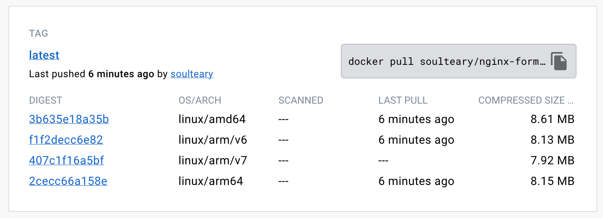

# Nginx Formatter

[](https://github.com/soulteary/nginx-formatter/actions/workflows/github-code-scanning/codeql) [](https://github.com/soulteary/nginx-formatter/actions/workflows/codecov.yml) [](https://github.com/soulteary/nginx-formatter/actions/workflows/scan.yml) [](https://github.com/soulteary/nginx-formatter/actions/workflows/release.yaml)  [](https://hub.docker.com/r/soulteary/nginx-formatter)

Nginx configuration formatter under 10MB size.

## Usage

```bash
Nginx Formatter

Usage of ./nginx-formatter:
  -char
    	Indent char, defualt:   (default " ")
  -indent int
    	Indent size, defualt: 2 (default 2)
  -input string
    	Input directory
  -output string
    	Output directory
```


## Docker



- https://hub.docker.com/r/soulteary/nginx-formatter
