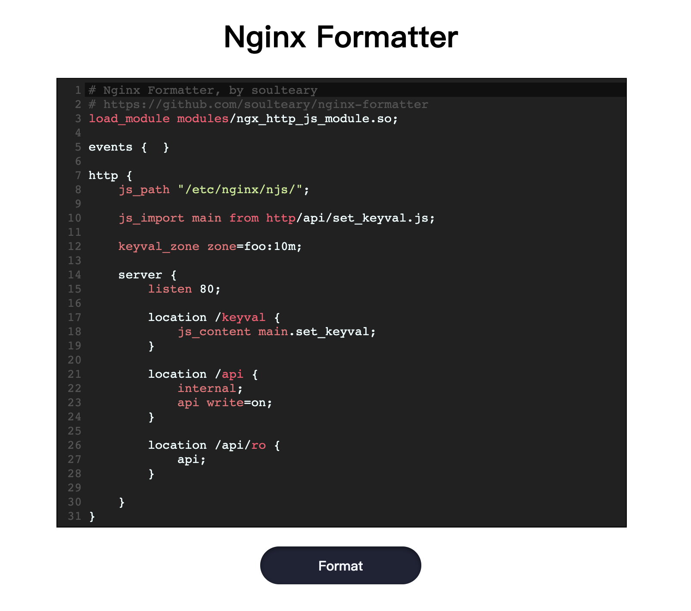
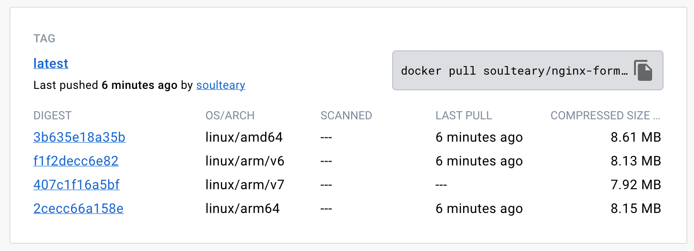

# Nginx Formatter

[](https://github.com/soulteary/nginx-formatter/actions/workflows/github-code-scanning/codeql) [](https://github.com/soulteary/nginx-formatter/actions/workflows/codecov.yml) [](https://github.com/soulteary/nginx-formatter/actions/workflows/scan.yml) [](https://github.com/soulteary/nginx-formatter/actions/workflows/release.yaml)  [](https://hub.docker.com/r/soulteary/nginx-formatter)

<p style="text-align: center;">
  <a href="README.md" target="_blank">ENGLISH</a> | <a href="README_CN.md">中文文档</a>
</p>


Nginx configuration formatter ~10MB size, support CLI, WebUI, x86, ARM, Linux, macOS.



> **What's new in v2.0.0**
>
> - Rewrote the formatting engine with a native Go AST-based nginx parser, replacing the previous `goja` / `beautifier.js` runtime. No JavaScript runtime dependency anymore, faster and lighter.
> - Switched the WebUI to the [Fiber](https://github.com/gofiber/fiber) web framework.
> - Upgraded to Go 1.26 with root-scoped filesystem access for safer directory traversal.
> - Various bug fixes: preserve backslash escapes in bare words, tolerate directives missing a trailing semicolon before `}` or EOF, and smarter `return` directive normalization.

## Download

Download the binaries for your system and architecture from the [releases page](https://github.com/soulteary/nginx-formatter/releases).



If you use docker, you can use the following command ([DockerHub](https://hub.docker.com/r/soulteary/nginx-formatter)):

```bash
docker pull soulteary/nginx-formatter:latest
docker pull soulteary/nginx-formatter:v2.0.0
```

### Homebrew

On macOS / Linux you can install it via [Homebrew](https://github.com/soulteary/homebrew-tap):

```bash
brew tap soulteary/tap
brew install soulteary/tap/nginx-formatter
```

After installation the `nginx-formatter` command is available globally, so you can run it directly (without the `./` prefix used below):

```bash
nginx-formatter -web
```

To upgrade or uninstall later:

```bash
brew upgrade soulteary/tap/nginx-formatter
brew uninstall nginx-formatter
```

## Usage

Use default parameters to format all configuration files in the current directory:

```bash
./nginx-formatter
```

### Common Usage (CLI & WebUI)

Use different indentation symbols (You can use spaces, tabs, ` `, `\s`, `\t`) and indentation amounts:

```bash
./nginx-formatter -indent=4 -char=" "
```

### CLI Usage

Format the configuration file in the specified directory:

```bash
./nginx-formatter -input=./your-dir-path
```

Format a file somewhere and save it in a new directory:

```bash
./nginx-formatter -input=./your-dir-path -output=./your-output-dir
```

Format a single file: when `-input` points to a file, only that file is formatted (any file extension is accepted, not just `.conf`). The `-output` value has three meanings in single-file mode:

- empty: overwrite the input file in place
- an existing directory: write to `<output-dir>/<original-file-name>`
- otherwise: treat it as a target file path, creating the parent directory if needed

```bash
# overwrite in place
./nginx-formatter -input=./nginx.conf

# write into an existing directory
./nginx-formatter -input=./nginx.conf -output=./dist

# write to a specific file path
./nginx-formatter -input=./nginx.conf -output=./dist/nginx.formatted.conf
```

### WebUI Usage

Start the web interface:

```bash
./nginx-formatter -web
```

specified the port:

```bash
./nginx-formatter -web -port=8123
```

### Docker Usage

There is no difference between using parameters in Docker and the above, for example, we start a Web UI formatting tool service in Docker:

```bash
docker run --rm -it -p 8080:8080 soulteary/nginx-formatter:v2.0.0 -web
```

If you want to format the configuration of the current directory, you can use the program in Docker with a command similar to the following:

```bash
docker run --rm -it -v `pwd`:/app soulteary/nginx-formatter:v2.0.0 -input=/app
```

## Full parameters supported

List of parameters supported:

```bash
Nginx Formatter

Usage of ./nginx-formatter:
  -char  
    	Indent char, defualt:   (default " ")
  -indent int
    	Indent size, defualt: 2 (default 2)
  -input string
    	Input directory
  -output string
    	Output directory
  -port 8080
    	WebUI Port, defualt: 8080 (default 8080)
  -web false
    	Enable WebUI, defualt: false
```

## Contributing

Contributions are welcome! Please read the [Contributing Guide](CONTRIBUTING.md) to get started, and follow the [Code of Conduct](CODE_OF_CONDUCT.md).

## Credits

Formatter Components

- Slomkowski Created a beautifier for nginx config files with Python under [Apache-2.0 license], 24/06/2016
  - https://github.com/1connect/nginx-config-formatter (https://github.com/slomkowski/nginx-config-formatter)
- Yosef Ported the JavaScript beautifier under [Apache-2.0 license], 24/08/2016
  - https://github.com/vasilevich/nginxbeautifier
- soulteary Modify the JavaScript version for golang execution, under [Apache-2.0 license], 18/04/2023:
  - simplify the program, fix bugs, improve running speed, and allow running in golang
  - https://github.com/soulteary/nginx-formatter
- soulteary Rewrote the formatter with a native Go AST-based nginx parser (dropping the JavaScript runtime), under [Apache-2.0 license], since v2.0.0:
  - https://github.com/soulteary/nginx-formatter

Web Components

- Fiber is an Express inspired web framework written in Go (Golang), under [MIT license].
  - https://github.com/gofiber/fiber
- Code Mirror, in-browser code editor, under [MIT license].
  - https://github.com/codemirror/codemirror5
